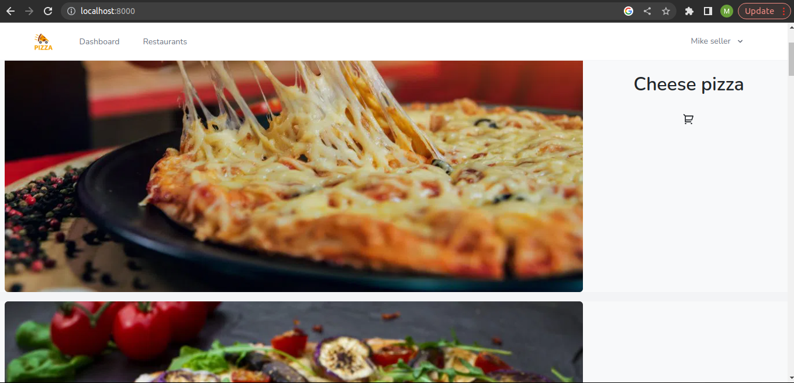
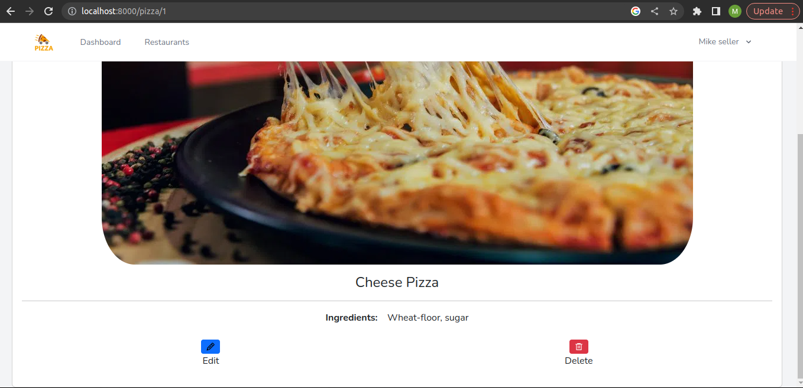
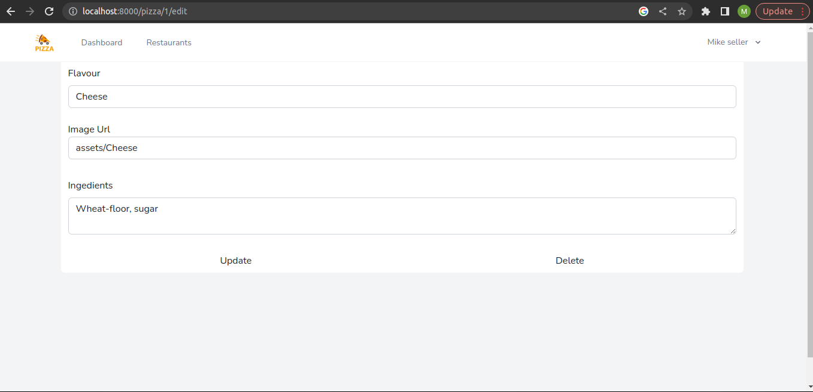
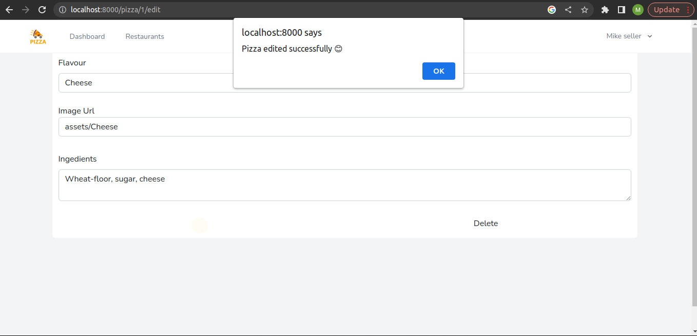
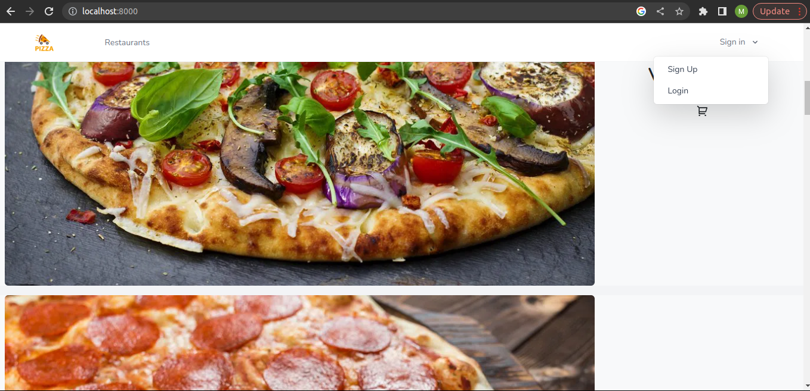
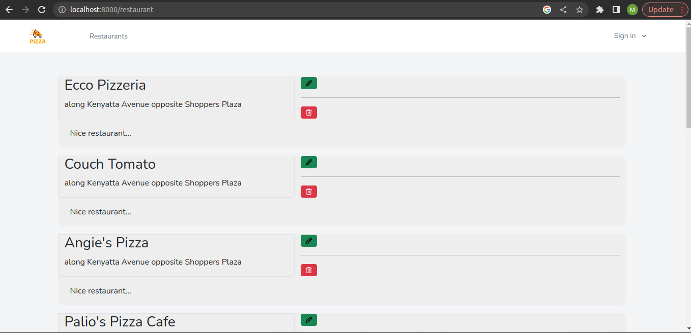
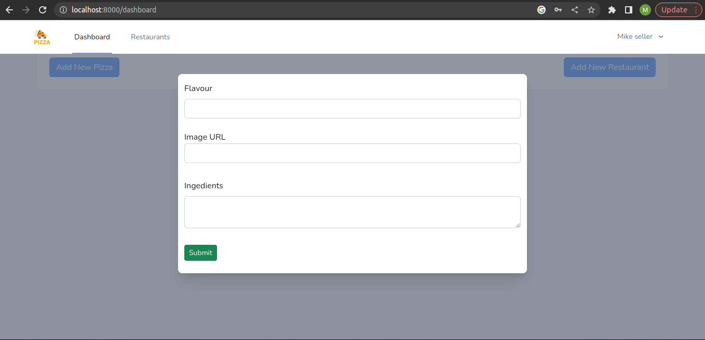
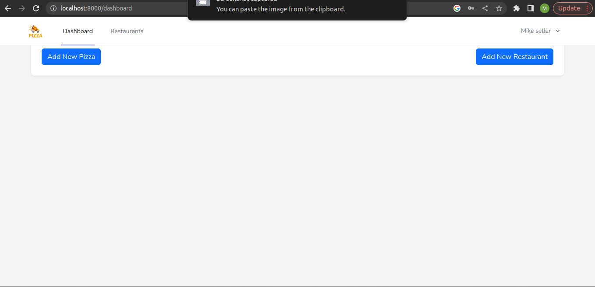

# PIZZA APP
<!-- Deployed link: https://pizza-project-rails.herokuapp.com -->

This is an app that manages pizzas, restaurants and relevant orders.

## User Abilities

A seller can:

* View, edit, delete pizza information and add a new pizza record
* View, edit, delete restaurant information and a new restaurant record
<!-- * View, edit, delete restaurant_pizza information and add a new record -->

A buyer on the other hand can only view.

Orders will be added soon.




















## Local Setup (client and server side)
To run the server locally, clone the code and run the following commands;
```
composer install
php artisan migrate --seed
php artisan serve
```
This will set up the server, with some random seed data.

```
npm install
npm run dev
```
This will set up the client side.

## Server Side and Database Information
Model relations - The tables being worked on were the restaurants,
pizzas and orders tables.

A restaurant `has_many` orders
A restaurant `has_many` pizzas `through` orders

A restaurant_pizza `belongs_to` restaurant
A restaurant_pizza `belongs_to` pizza

A pizza `has_many` orders
A pizza `has_many` restaurants `through` orders

## Stack
React v18.2.0

Vite v4.0.0

Php v8.0.2

Laravel v9.47.0


